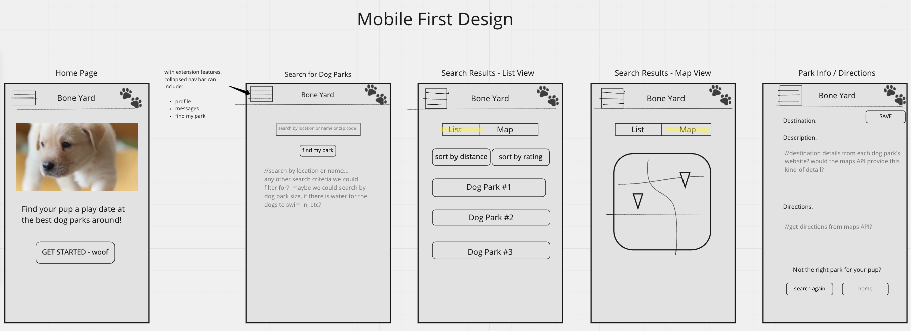
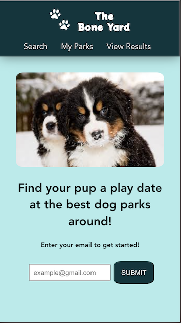
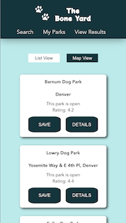
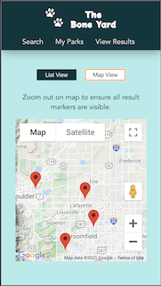
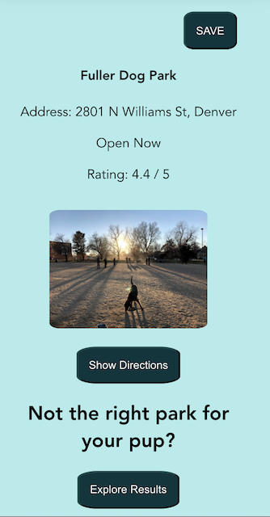
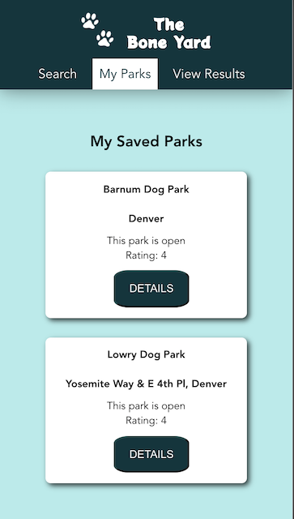

# The Bone Yard -- Frontend

## Project Description 

This application is a dog park locator that allows users to search for dog parks near them or to search by city and state. Users can view details about a particular dog park, get driving directions to a specific dog park, and save dog parks they are interested in. This is a full stack application with the front-end housed on this repository. The repository for the back-end can be found [here](https://github.com/the-bone-yard/backend-repo). This project is the capstone project completed during the final module of the Front End Engineering program at the Turing School of Software and Design. 

The BoneYard deployed application can be found [HERE.](https://the-bone-yard-fe.herokuapp.com/#/)

## Contributors

Bret Merritt - [LinkedIn](https://www.linkedin.com/in/bret-merritt/) || [GitHub](https://github.com/bretm9)

Nathan Darrington - [LinkedIn](https://www.linkedin.com/in/nathandarrington/) || [GitHub](https://github.com/npdarrington)

Nicole Gooden - [LinkedIn](https://www.linkedin.com/in/nicolemgooden/) || [GitHub](https://github.com/nicolegooden)

Stacy Potten - [LinkedIn](https://www.linkedin.com/in/stacy-potten/) || [GitHub](https://github.com/stacyp2006)

## Front-End Technologies

- JavaScript
- Vue
- GoogleMaps API
- Jest
- Babel
- HTML5
- CSS/SCSS
- Travis CI
- Heroku

## Set-up

If you would like to view the project codebase on your local machine, follow the following steps: 
  - `cd` into your directory of choice and clone down the repo with `git clone git@github.com:the-bone-yard/frontend.git`
  - `cd` into the repo directory 
  - Run `npm install`
  - Run `npm start` and view the site on https://localhost:8080
  - `^C` will terminate the server
  - Test suites can be viewed by running `npm run test:unit`
  
## The BoneYard in Action

### The Planning Phase

### Home Page

### Search Functionality
- giphy

### Results 

### Park Details

### Saved Parks

  
## Future Iterations
While we are very pleased with the results of our efforts so far, we are just as excited about the improvements that are still to come for The BoneYard. From a frontend perspective, we would like to: 

- Enable better user authentication 
- Allow pet owners to create profile(s) for their dog(s)
- Allow dogs to "friend" one another 
- Send messages between users to schedule puppy play dates at a dog park
- Remove park from saved parks
- More and improved error handling (including routes)
- Sort results by rating and/or distance from current location

A full list of Issues we would like to implement in the future can be found [here](https://github.com/the-bone-yard/frontend/issues)

## Additional Links
- [Project Board](https://github.com/orgs/the-bone-yard/projects/1)